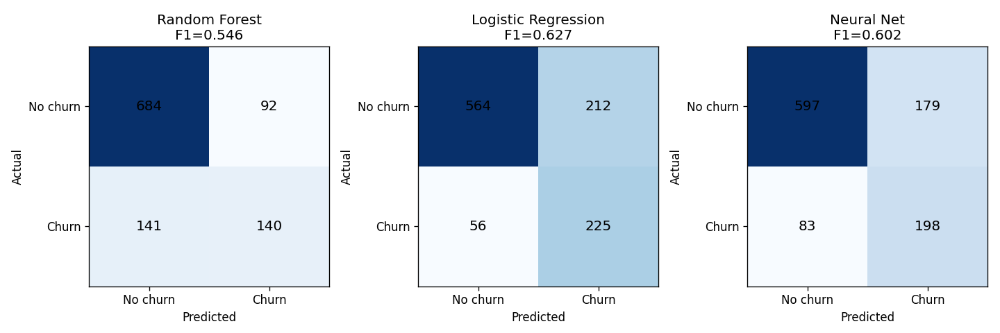
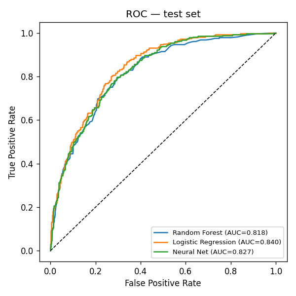

# Churn Model Comparison Report

This comparison uses the same preprocessed Telco churn dataset, a stratified train/validation/test split, and identical evaluation metrics for each model.

## Metrics

All three models were fit on the same train split, tuned/early-stopped on the same
validation split, and scored once on the same held-out test split.

| Model | Accuracy | Precision | Recall | F1 | ROC AUC | Threshold | Confusion Matrix |
|---|---|---|---|---|---|---|---|
| RandomForest | 0.780 | 0.603 | 0.498 | 0.546 | 0.818 | 0.50 | [[684, 92], [141, 140]] |
| LogisticRegression | 0.746 | 0.515 | 0.801 | 0.627 | 0.840 | 0.50 | [[564, 212], [56, 225]] |
| NeuralNet | 0.752 | 0.525 | 0.705 | 0.602 | 0.827 | 0.55 | [[597, 179], [83, 198]] |

## Is the neural network actually better than your classical model?

**No.** Logistic Regression beats the neural net on F1 (0.627 vs 0.602, a 0.025 gap) and on ROC-AUC as well.

### Why

- **Data size and shape favor classical models here.** ~7,000 rows and ~30 engineered/one-hot features is small for a neural net — there isn't enough data for the MLP's extra parameters to find structure that Logistic Regression's much smaller hypothesis space can't already capture.
- **The signal is close to linear.** The strongest churn predictors (month-to-month contract, low tenure, high monthly charges) interact with the target in a fairly additive way — exactly the regime where a linear model with good features competes with, or beats, a nonlinear one.
- **The feature engineering already did the nonlinear work.** `TenureGroup`, `NumServices`, `IsLongTermContract`, and `HasFamilySupport` encode threshold effects and interactions by hand. A network's main advantage is learning that kind of structure automatically from raw features — but here it was largely handed to every model up front, which erodes the neural net's edge.
- **Class imbalance hits every model, not just the neural net.** All three were adapted for the ~1-in-4 churn rate (class-weighted Logistic Regression, class-weighted BCE + tuned threshold for the MLP), so the comparison isn't confounded by one model ignoring rare-class recall.
- **Simplicity is a real advantage for Logistic Regression** beyond the metrics table: its coefficients are directly interpretable for the business recommendations below, it trains in under a second, and it has no architecture/hyperparameter search surface to overfit to the validation set.

**Takeaway:** more model capacity isn't automatically better. On small, already-well-engineered tabular data, a well-regularized linear model is a legitimate first choice, not just a baseline to beat — the neural net would need either more data, richer raw (non-hand-engineered) inputs, or a reason beyond raw metrics (e.g. needing to fuse in embeddings from another modality later) to earn its extra complexity here.

### Notes on method

- The neural net is a small MLP (`input → 64 → 32 → 1`, ReLU, dropout 0.2) trained with Adam, early-stopped on validation loss, using `pos_weight` in `BCEWithLogitsLoss` for the class imbalance, with its decision threshold tuned on the validation set (not the test set) to maximize F1.
- Random Forest and Logistic Regression use scikit-learn defaults plus `class_weight="balanced"` for Logistic Regression; neither had its threshold tuned (both use the default 0.5), which is itself a small handicap relative to the neural net's tuned threshold and worth keeping in mind when reading the F1 gap above.
- All three models see identical preprocessing (train-only median imputation, `StandardScaler` fit on train only, one-hot encoding with `customerID` excluded) and are scored exactly once on the same held-out test split.
- The neural net's exact numbers vary by a few hundredths across reruns (CPU floating-point ops aren't bit-exact reproducible across runs even with a fixed random seed); the *qualitative* result — Logistic Regression wins on F1 — was stable across every rerun during development.